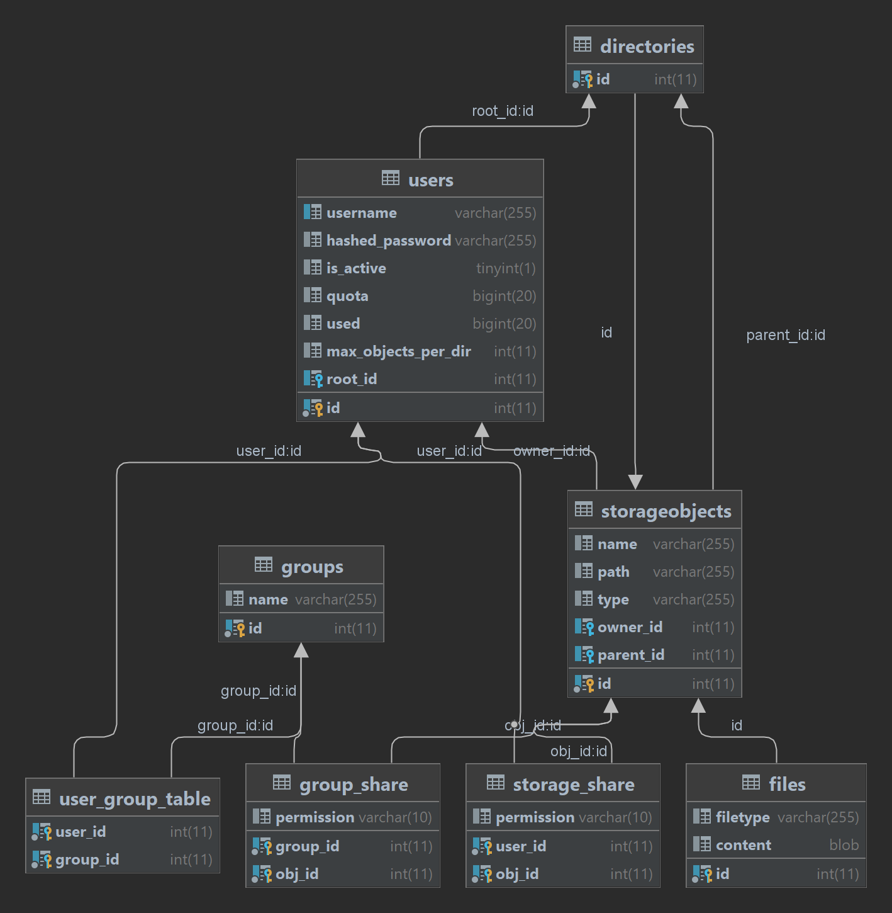
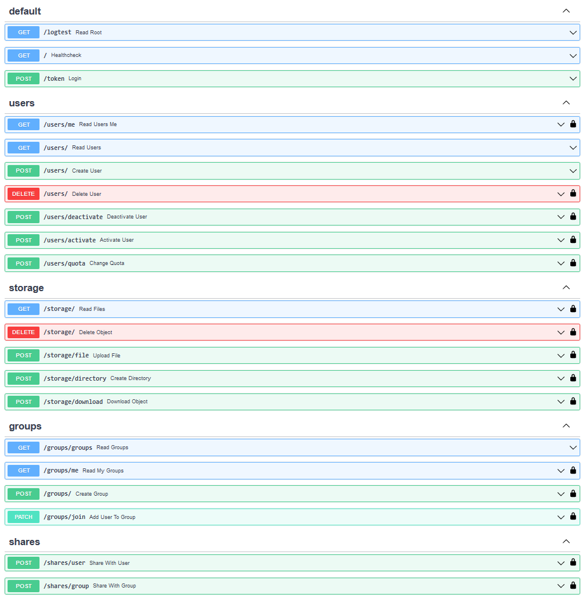

# Filer

### Installation

##### Database
1. navigate to `app/backend`
2. run `docker-compose up`
3. wait for db startup

##### Backend
1. make sure you have python >= 3.10 installed
2. navigate to project-root 
3. run `pip install -r requirements.txt`
4. navigate to `app/backend/app`
5. webserver: `python -m uvicorn main:app` (add `--reload` for live-servering)

##### Frontend
1. install [npm](https://www.npmjs.com/)
2. navigate to `app/frontend`
3. run `npm i`
4. run `npm start`

### Tests

##### Crud
1. navigate to `app/backend/tests`
2. run `docker-compose up`
3. run `pytest .\crudtest.py`

### Design

##### Data Model

##### REST API

